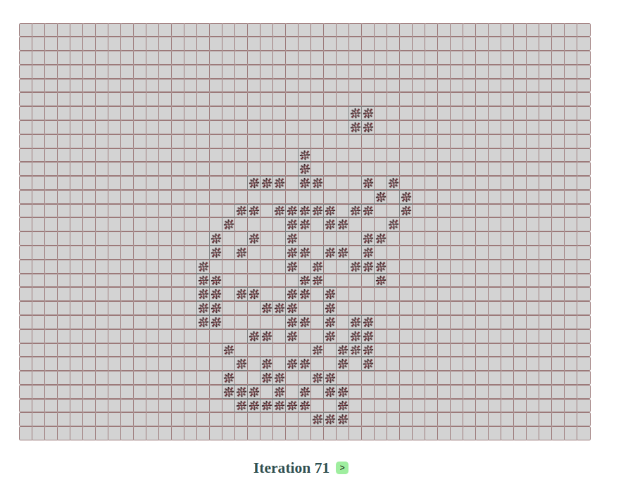

# game-of-life-cljs

Simple implementation of Conway's Game of Life in ClojureScript.

## Overview

## Development

To get an interactive development environment run using [Leiningen](https://leiningen.org/).

    lein fig:build

This will auto compile and send all changes to the browser without the
need to reload. After the compilation process is complete, you will
get a Browser Connected REPL. 

To clean all compiled files:

	lein clean

To create a production build run:

	lein clean
	lein fig:min

